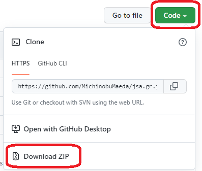

# jsa.gr.jp テスト環境

jsa.gr.jp の 2022年5月時点の PHP のバージョンは 7.4 です。また同じ時点で DokuWiki は PHP の 7.4 より新しいバージョンに対応していません。 PHP は最新の 8.1 や 8.0 ではなく 7.4 を使ってください。

## Windows の場合

### 1. PHP 7.4

<https://windows.php.net/download> から PHP 7.4 VC15 x64 Thread Safe の ZIP をダウンロードして、どこか ( 例: `C:\php7.4` ) に解凍する。

PHPを置いたフォルダの `php.ini-development` を同じフォルダの `php.ini` にコピーして、以下の 3か所の先頭の `;` を削除する。

    ;extension_dir = "ext"

    ;extension=gd2

    ;extension=mbstring

### 2. ツール一式

https://github.com/MichinobuMaeda/jsa.gr.jp-test の Code ボタンの Download ZIP リンクからダウンロードして、どこか ( 例: `C:\home\jsazenkoku` ) に解凍する。

ツール一式の中の `env_sample.bat` を同じフォルダの `env.bat` にコピーして `PHP_HOME` の値をPHPを置いた場所に変更する。

ツール一式の中の `phpinfo.bat` を実行してPHPが正常に動くことを確認する。終わりの方に次のよう表示されるはず。

    If you did not receive a copy of the PHP license, or have any
    questions about PHP licensing, please contact license@php.net.
    PHP 7.4.29 (cli) (built: Apr 14 2022 18:14:39) ( NTS Visual C++ 2017 x86 )
    Copyright (c) The PHP Group
    Zend Engine v3.4.0, Copyright (c) Zend Technologies
    続行するには何かキーを押してください . . .

### 3. テスト用サーバの起動

本物のサーバの `/home/jsazenkoku/www/zenkoku` の下から以下のフォルダとファイルを `www/zenkoku` にダウンロードする。

- index.html ( トップページ )
- css
- img
- js
- 自分が担当するコーナーのフォルダとファイル

自分の担当分だけでなく全部でもよい。

`www/.gitignore` と `www/zenkoku/.gitignore` は GitHub に空のフォルダを保存するためのダミーのファイルなので無視してよい。消してもよい。 Windows のエクスプローラーの設定によっては非表示かもしれない。

ツール一式の中の `serve.bat` を実行してテスト用サーバを起動する。次のよう表示されるはず。

    [Sun May 15 19:44:01 2022] PHP 7.4.29 Development Server (http://localhost:8000) started

テスト用サイトは http://localhost:8000/ で参照できる。
リンクのクリック等で本物に移動してしまったら https://jsa.gr.jp/ を http://localhost:8000/ に置き換える。
以下の2点を除き、本物と見た目は同じ。

- DokuWiki と PukiWiki は表示だけ。編集機能などは使えない。
- 会員専用コーナーはID・パスワード無しで参照できる。

テスト用サーバは [Ctrl]+[C] ( Ctrl キーと C を同時に押す ) で終了できる。
ウィンドウの右上の x をクリックして閉じてもよい。

### 4. 『日本の科学者』表紙画像のリサイズ

事務局から受け取った『日本の科学者』の表紙の画像 `jjsYYYYMM.jpg` を幅300ピクセルに縮小したものを　`www/zenkoku/jjs-cover-s.jpg` にコピーするには、コマンドプロンプトで次のように操作する。

    > cd C:\home\jsazenkoku
    > env.bat
    > php resize_image.php path_to/jjsYYYYMM.jpg

### 5. DokuWiki の編集機能

DokuWiki の編集機能を使いたい場合は `www/zenkoku/d/conf/local.php` の次の値を 1 から 0 に変更する。ただし動作の保証はできない。また、編集したものをアップロードすることもできないので、本物の方で編集し直すこと。

    $conf['userewrite'] = '1';

## Mac OS の場合

PHP を Homebrew 等でインストールする。

    % brew install php@7.4

`env_sample_mac_m1.sh` を `env.sh` にコピーし、必要に応じて `PHP_HOME` の値を編集する。

ツール一式のコピーは Windows と同様。

ターミナルを開いてこのスクリプトを実行する。

    % cd /home/jsazenkoku
    % source ./env.sh

PHPが正常に動くことを確認する。

    % php --version

テスト用サーバを起動する。

    % php -S localhost:8000 -t www/zenkoku router.php

テスト用サーバは ^C ( Control と C を同時に押す ) で終了できる。

『日本の科学者』表紙画像のリサイズや DokuWiki のための設定は Windows と同様。

`rsync` や `scp` が利用できる場合は `sync.bat` または `sync.sh` でサーバのファイルのダウンロード、 `upload.php` でファイルのアップロード、 `upload-jjs.php` で『日本の科学者』目次更新時の一括アップロードができる。

### Linux の場合

php をインストールする手順以外は Mac OS と同様。
